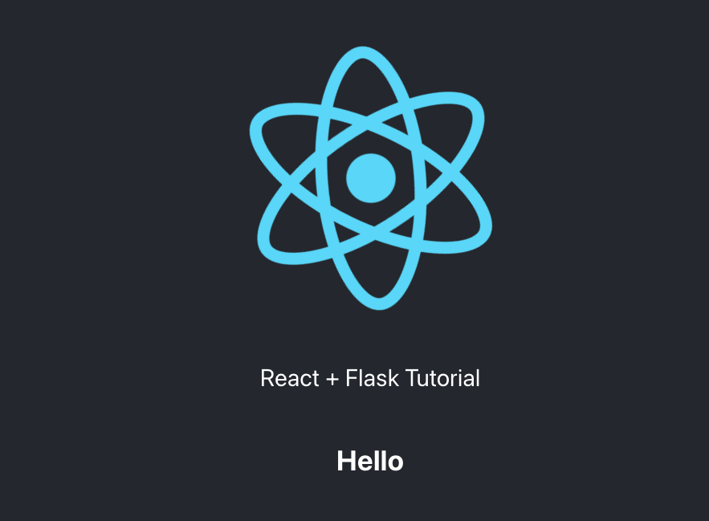

# circleci-gke-frontend-demo

[](https://circleci.com/gh/japac-demo/circleci-gke-frontend-demo/tree/master)

https://app.gke-demo.tadashi-cci.com/

React application deployed on gke

* Fetches api(Python + Flask) and shows response
    * https://app.gke-demo.tadashi-cci.com/api/



* Use gcp-gke orb to docker build + rollout image to gke
    * https://circleci.com/developer/orbs/orb/circleci/gcp-gke
```yaml
- gcp-gke/publish-and-rollout-image:
    executor: docker-build
    context: tadashi-demo-deploy-gke
    cluster: circleci-gke-demo
    container: frontend
    deployment: frontend
    image: circleci-gke-frontend-demo
    registry-url: asia.gcr.io
    tag: $CIRCLE_SHA1
    use-remote-docker: false
```

* Use node orb to install dependency(yarn) and test(react testing library)
    * https://circleci.com/developer/orbs/orb/circleci/node
```yaml
- node/test:
    pkg-manager: yarn
    version: 14.17.0
```
